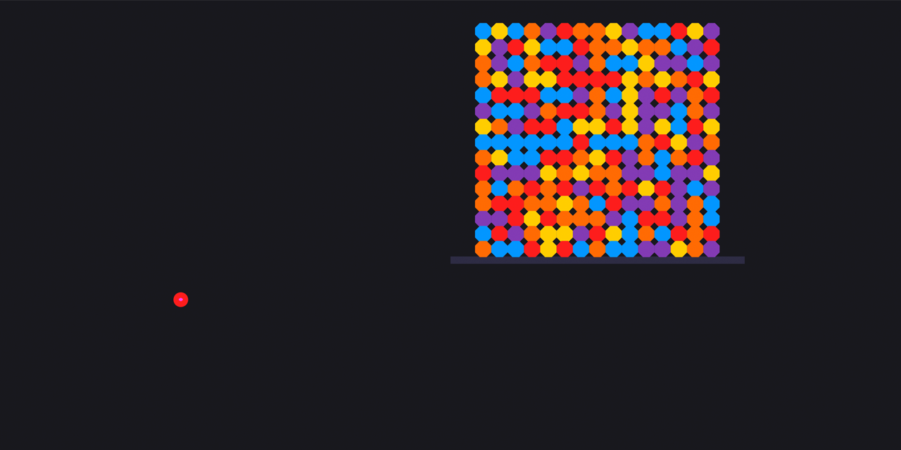

<p id="header"><p>

<table><tr>
<td> <a href="https://github.com/emjose/kboard/#header"></a> </td>
<td> <a href="https://github.com/emjose/one-hundred/#header"></a> </td>
<td> <a href="https://github.com/emjose/toast-notifications/#header"></a> </td>
</tr></table>

<br>

<p id="project-title"><p>

<a href=#table-of-contents></a> 

<br>

<a href="https://emjose.github.io/slingshot/"></a> 

#

<p id="table-of-contents"><p>

<a href=#table-of-contents></a>  

- [100 Days of Code](#100days)
- [Installation](#installation) 
- [Live Site](#live-site)
- [Resources](#resources)
- [Let's Connect!](#lets-connect) 

#

<p id="100days"><p>

<a href=#100days></a>  

### Day 21: March 1, 2021
- I love playing <a href="https://www.angrybirds.com/">Angry Birds</a>, and I followed a tutorial on creating a simple slingshot game with <a href="https://brm.io/matter-js/">Matter.js</a>.
  
- <a href="https://brm.io/matter-js/">Matter.js</a> is a powerful 2D rigid body physics engine written in JavaScript.

#

<p id="installation"><p>

<a href=#installation></a>

#### Git clone and cd into the repo folder:
``` 
git clone git@github.com:emjose/slingshot.git && cd slingshot 
```
#### Run the command:
```
open index.html
```
#### Operate the slingshot, or directly move the Matter.js bodies with your cursor.

#

<p id="live-site"><p>

<a href="https://emjose.github.io/slingshot/"></a>  

<a href="https://emjose.github.io/slingshot/"></a>

#

<p id="resources"><p>

<a href=#resources></a>  

- #### [Slingshot Tutorial](https://youtu.be/PsL3iI61wl8) by [Red Stapler](https://www.youtube.com/channel/UCRthRrv06q1iOl86-tTKJhg) 
  
- #### [Angry Birds with Matter.js](https://youtu.be/TDQzoe9nslY) by [The Coding Train](https://www.youtube.com/channel/UCvjgXvBlbQiydffZU7m1_aw)
  
- #### [Matter.js Home](https://brm.io/matter-js/) by [Liam](https://brm.io/)

- #### [Matter.js Demos](https://brm.io/matter-js/demo/#mixed)

#

<p id="lets-connect"><p>

<a href=#lets-connect></a>

<p><a href="https://twitter.com/Emmanuel_Labor"> <a href="https://www.linkedin.com/in/emmanuelpjose/"> <a href="https://emmanueljose.medium.com/"> <a href="https://www.instagram.com/emmanuel_jose/"> <a href="mailto:emjose@gmail.com"> <a href="https://www.youtube.com/channel/UCQdqFg-_J83jn9xJRd1W3tQ/videos"> <a href="https://github.com/emjose"></p>

#

<a href=#header></a>